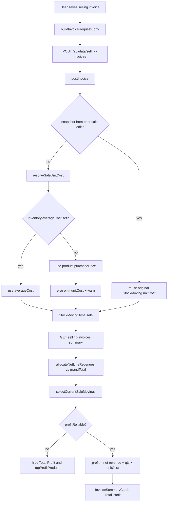
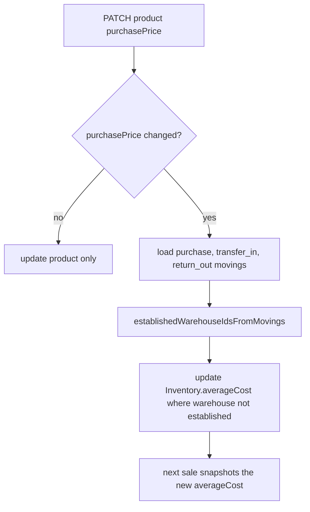
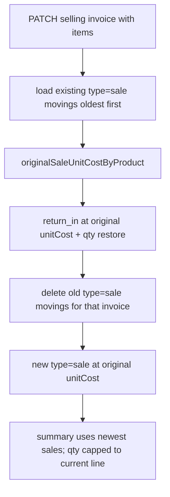

# Total Profit

The **Total Profit** card on the selling-invoices page is the sum of product margins for posted sales in the selected date range.

```text
Total Profit = Net sales revenue − Cost of goods sold (COGS)
```

It is **not** cash in the drawer, and it is **not** “selling price minus the product’s current buying price” after every catalog edit.

Three numbers stay separate on purpose:

| What you edit | What it means | Does it change Total Profit of old sales? |
| --- | --- | --- |
| Product selling price (`retailPrice`) | Default price on the next invoice | No. Already-posted sales keep their invoice price. |
| Product buying price (`purchasePrice`) | Current catalog / default buying price | No for already-posted sales (sale `unitCost` is frozen). The **next** sale uses the new cost only on warehouses with **no** purchase or transfer-in history. |
| Invoice line selling price (`unitPrice`) | What the customer actually paid | Yes for **that** invoice’s revenue. Cost stays the inventory cost. |
| Buying invoice | A real purchase that updates inventory cost (WAC) | Future sales in that warehouse use the new average cost. Past sales stay frozen. |
| Warehouse transfer-in | Copies source cost onto the destination warehouse | Future sales at the destination use that cost. Catalog buy-price edit must not overwrite it. |

Missing cost is **unknown** (`profitReliable: false`), never silently 0.

Posted sale cost is **immutable** once the sale is accepted. Online that is
`StockMoving.unitCost`. Offline POST stamps `unitCost` on the local invoice
line for display and local profit; the outbox payload does not send it. The
server still resolves COGS on replay. Local profit uses only that stamp —
missing `unitCost` is unreliable, never live WAC. Pull/sync keeps an existing
local stamp when the server invoice omits it.

---

## 1. Simple language

For shop owners and cashiers. Same rule in every case: **profit is what you sold it for, minus what that stock actually cost.**

### The formula in one sentence

If you sell a bottle for 15 and that bottle cost the shop 10, profit is 5.

If the invoice has a discount, profit uses the **money after the discount**, not the sticker total before the discount.

### Case A — New product, opening stock, typed the buying price wrong

You create Coca Cola:

- Buying price: 100 (mistake, extra zero)
- Selling price: 150 (mistake)
- Opening stock: 10

You notice and correct:

- Buying price: 10
- Selling price: 15

Then you sell 1 bottle at 15.

**Result:** revenue 15, cost 10, profit **5**.

Why: this stock was never bought on a buying invoice and never transferred in. The buying price on the product **is** the cost of that opening stock, so correcting it must correct the cost used on the next sale.

### Case B — Stock that was really purchased (or transferred in)

You bought 100 units at 10 each. Inventory cost is 10.

Later you change the product buying price to 12, but you do **not** buy more stock.

You sell 1 unit.

**Result:** cost stays **10**, not 12.

Why: those units were actually bought at 10. Changing the catalog price is a new list price, not a rewrite of history.

Same if the warehouse received the stock by **transfer-in**: that copied cost is established WAC. A catalog buy-price edit must not overwrite it.

### Case C — You change the price only on the invoice

Product selling price is 15. On this invoice you charge 25. Inventory cost is 10.

**Result:** revenue 25, cost 10, profit **15**.

Changing the invoice selling price never changes cost.

### Case D — You type both prices quickly on the product row

Old: buy 100, sell 150. You change buy to 10, then sell to 15.

**Result:** the product must end at buy 10 and sell 15. The old 100 must not come back.

### Case E — You edit an invoice that is already posted

Original: sold for 20, cost 10, profit 10. You change the selling price to 25.

**Result:** revenue 25, cost **10**, profit **15**. Cost must not become 20 (that would mean the old sale and the new sale were both counted).

### Case F — Invoice discount

Line total 100, invoice discount 10, cost 60.

**Result:** net sales 90, profit **30**.

Profit must not pretend you collected 100.

### Case G — Missing cost (online or offline)

If a sold line has no cost, Total Profit and Top Profit Product stay hidden. The app must not show “sales” as if it were profit.

- **Offline:** no snapshot `unitCost` on the local invoice line, and no local `averageCost` or `purchasePrice` on the sold product.
- **Online:** a sale moving is missing, or a sale moving has no `unitCost`.

After you go back online, the server records COGS on post. The server is the source of truth. The app never sends a cost figure that the server blindly trusts.

If the phone/app **does** know the local buying cost, it can show profit the same way: net sales minus that cost. That figure is an estimate until sync.

### Case H — Date range

The From / To dates on the selling-invoices page apply to **posted** invoices in that period (not drafts or cancelled). Period Sales is the sum of those invoice totals. Total Profit is margin on those same invoices.

---

## 2. Economic / accountant language

Gross margin on **realized sales**, using **historical cost** for established inventory and **catalog cost** only for unestablished opening stock.

Established vs opening is **per warehouse**.

### Definitions

| Term | In this product | Accounting reading |
| --- | --- | --- |
| `retailPrice` | Current default selling price | List / standard selling price. Not recognized revenue. |
| Invoice `unitPrice` / `lineTotal` | Price charged on that invoice | Gross sales (before invoice-level discount). |
| Invoice `grandTotal` (primary currency) | Amount of the invoice | Net sales after invoice-level discount. |
| `purchasePrice` | Current catalog buying price | Replacement / list cost. Not automatically COGS. |
| `Inventory.averageCost` | Cost basis of on-hand qty in that warehouse | WAC once a purchase or transfer-in exists there; opening cost until then. |
| `StockMoving.unitCost` (`type: sale`) | Cost frozen at posting | Historical COGS for that issue of stock. Optional; missing cost makes profit unreliable, not zero. |
| `summary.profitReliable` | Whether period COGS is complete | False if any sold qty lacks a sale moving or a finite `unitCost`. |
| Total Profit | Σ (net line revenue − sale `unitCost` × qty) when reliable | Period gross profit / gross margin on sales. |

Recognized revenue is **not** catalog `retailPrice`. COGS is **not** catalog `purchasePrice` once a warehouse has established WAC.

### Cost basis policy

**Unestablished opening inventory** (that warehouse has no `purchase` and no `transfer_in` moving):

- Opening `averageCost` is seeded from `purchasePrice`.
- A later catalog `purchasePrice` correction updates `averageCost` on those warehouses only.
- The next sale snapshots that cost onto `StockMoving.unitCost`.

Rationale: there is no purchase invoice or transfer to defend a historical cost. The catalog buy price is the only cost basis.

**Established inventory** (that warehouse has at least one `purchase` or `transfer_in`):

- Purchases update WAC:

```text
new WAC = (priorQty × priorWAC + purchaseQty × purchasePrice) / (priorQty + purchaseQty)
```

- Transfer-in copies the source warehouse `averageCost` and locks the destination the same way a purchase does.
- A catalog-only `purchasePrice` change does **not** revalue on-hand stock in that warehouse.
- Sales consume WAC at posting time and freeze it on the sale moving.
- Qty-weighted WAC skips warehouses with no finite `averageCost`; missing cost is not treated as 0.

Rationale: IAS-style historical cost / WAC. List-price edits are not inventory revaluations.

**Cancelled buying invoice:** a `return_out` on the same `referenceId` as the purchase means that purchase no longer locks the warehouse. Catalog buy-price edits may correct opening cost again. Cancel does **not** unwind WAC on the remaining qty (see later tickets).

**Explicit revaluation** of established stock is **not** a catalog edit. That would be a separate inventory-cost adjustment (not built yet; see later tickets).

### Revenue and discount

Period sales = Σ primary `grandTotal` of in-period, stock-affecting invoices.

Product-level revenue used in profit = line revenue after allocating `linesSum − grandTotal` across lines in proportion to line totals. Sum of allocated line revenues equals net sales.

Invoice `unitPrice` changes net sales only. It does not change COGS.

### Subsequent measurement of a posted invoice

Editing a posted invoice is not a new purchase. Reverse the original issue at the **original** `unitCost`, retire the old `sale` moving, then re-issue at that same snapshot (unless the line is new and has no snapshot). Extra qty of a product that already has a snapshot keeps that `unitCost`. Gross profit on a price-only edit is Δrevenue only.

### Period close / reports

Total Profit is a **management gross-margin** figure for the selected invoice dates. It excludes:

- expenses, receipts, and other daily-actions (those sit on cash balance)
- tax (line tax is currently 0 in invoice math)
- unrealized holding gains from catalog price changes

When `profitReliable` is false, `totalProfit` is returned as 0 and `topProfitProduct` is null. The UI hides both cards (`showProfit` is `profitReliable === true`). Best seller still uses sold qty from invoice lines.

### Offline

Local profit uses the `unitCost` stamped on the invoice line at POST. If that snapshot is missing, it falls back to local `averageCost` or `purchasePrice`. If neither exists, the figure is withheld (`profitReliable: false`). On sync, the API posts the invoice and records server-side COGS. Client `unitCost` is never sent on the outbox and is never authoritative.

Local opening-cost correction only looks at local buying invoices (not transfer-in). Those inventory rows are marked `pending` so a pull cannot clobber the correction before the product PATCH replays.

---

## 3. Code and workflow

### Data model

```text
Product.price.purchasePrice     current/default buying price
Product.price.retailPrice       current/default selling price
        │
        ├── opening stock, no purchase and no transfer_in in that warehouse
        │     → seeds / corrects Inventory.averageCost
        │
        ├── buying invoice (purchase moving)
        │     → WAC on Inventory.averageCost (catalog edit must not overwrite)
        │
        └── transfer_in
              → destination averageCost locked like a purchase

Inventory.averageCost           cost basis of current qty (per warehouse)
        │
        └── sale (posted selling invoice)
              → StockMoving.unitCost   historical COGS snapshot (optional)
              → invoice line unitPrice  actual selling price
```

### One-sale workflow (online)



`resolveSaleUnitCost` never uses invoice `unitPrice`. The request body has no client cost field. Missing cost is omitted on the moving (`unitCost` is optional), not stored as 0.

### Opening-cost correction workflow



A warehouse is established if it has a `purchase` (unless that buying invoice was cancelled with `return_out` on the same `referenceId`) or a `transfer_in`.

Inline UI sends only the changed field, e.g. `{ "price": { "purchasePrice": 10 } }`. The server merges onto the stored price object.

### Posted-invoice edit workflow



### Summary math (server)

Period invoices: in date range, not draft / cancelled / void / pending.

```text
lineRevenue     = lineTotal ?? qty × unitPrice
netLineRevenue  = lineRevenue − (lineRevenue / linesSum) × (linesSum − grandTotal)
COGS            = Σ selected sale movings: quantity × unitCost
profitReliable  = every sold qty has a sale moving with a finite unitCost
Total Profit    = profitReliable ? Σ (netLineRevenue − COGS) by product : 0
```

`selectCurrentSaleMovings` keeps the newest `type: sale` rows whose qty covers the current invoice lines, and **caps** a leftover stacked moving to the current line qty so older edits do not double COGS.

Best seller = highest **invoice line** qty (`quantitySold` from lines, not from movings). Top profit product = highest profit. Both require `quantitySold > 0`. Top profit is omitted when `profitReliable` is false.

### Offline

```text
GET selling-invoices (offline)
  → Dexie invoices + products + inventory
  → line.unitCost (stamped at POST) else resolveLocalSaleUnitCost(averageCost, purchasePrice)
  → if any sold line has no cost: profitReliable = false
  → hide Total Profit and topProfitProduct
  → else profit = net revenue − qty × snapshot/local cost
  → best seller still uses line qty

POST selling-invoices (offline)
  → local invoice lines get unitCost snapshot
  → outbox payload has no unitCost
  → sync/push replays postInvoice; server records unitCost
```

Local product create seeds inventory `averageCost` from `purchasePrice`. Local `purchasePrice` PATCH updates that cost only if there is no non-draft local buying invoice for the product (transfer-in is not checked locally) and marks those inventory rows `pending`.

Frontend re-exports `allocateNetLineRevenues` / pickers from
`packages/store-domain` and keeps local-only helpers
(`buildLocalPeriodProductAggregates`, `resolveLocalSaleUnitCost`) in
`invoiceProfitSummary.ts`.

### Where it lives

| Layer | File / symbol |
| --- | --- |
| Opening vs WAC (per warehouse) | `packages/store-domain/src/inventoryCost.ts` (`establishedWarehouseIdsFromMovings`) |
| Purchase WAC | `purchaseAverageCostExpression` in `movingAverageCost.ts` |
| Sale cost | `resolveSaleUnitCost`, `applySaleInventoryAdjustments`, `reverseSaleInventoryAdjustments` in `selling-invoice/api.controller.ts` |
| Catalog buy-price edit | `patchProduct` → `syncOpeningAverageCostOnPurchasePriceEdit` in `api.controller.ts` |
| Period profit | `buildSellingInvoicesSummary` + `packages/store-domain` (`sellingInvoiceProfit.ts`) |
| AI profit | `shared/reportAi/tools.ts` (`buildPeriodProductAggregates` / `selectCurrentSaleMovings`) |
| Inline price PATCH | `web/.../productInlineEdit.ts` (`buildPriceFieldPatch`) |
| Offline profit | `web/.../invoiceProfitSummary.ts`, `offline/localHandlers.ts` |
| UI | `InvoiceSummaryCards.tsx` (`showProfit` from `profitReliable === true`) |
| Tests | `sellingInvoiceProfit.test.ts`, `productPricePatch.test.ts`, `invoiceProfitSummary.test.ts`, `productInlineEdit.test.ts` |

### HTTP

| Method | Path | Role |
| --- | --- | --- |
| POST | `/api/data/selling-invoices` | Post sale, snapshot COGS (`unitCost` omitted if unknown) |
| PATCH | `/api/data/selling-invoices/:id` | Edit posted sale without double-counting COGS |
| GET | `/api/data/selling-invoices?dateFrom&dateTo` | Period sales + `summary.totalProfit` + `summary.profitReliable` |
| PATCH | `/api/data/products/:id` | Catalog prices; may correct opening `averageCost` per unestablished warehouse |
| POST | `/api/data/sync/push` | Replay offline sales through the same `postInvoice` |

---

## Later Jira tickets

Titles only. Not in the current implementation.

1. **Explicit inventory cost adjustment for established WAC** — revalue on-hand stock without a buying invoice; audit log; do not use catalog `purchasePrice` for this.
2. **Profit by warehouse, cashier, and customer** — same COGS rule, extra group-by.
3. **Profit in display currency** — convert net revenue and COGS with the same rate policy as invoice totals.
4. **Include tax in profit (or exclude it consistently in the UI label)** — line tax is currently 0.
5. **FIFO / specific identification option** — alternative to WAC for tenants that need lot cost.
6. **Cancelled-purchase WAC unwind** — cancelling a buying invoice unlocks catalog overwrite, but remaining `averageCost` is not recalculated.
7. **Holding-gain report** — catalog `purchasePrice` vs WAC, separate from Total Profit.
8. **Date-range comparison / sparkline for profit** — period vs previous period (sales sparkline exists; profit trend is unused).
9. **Treat transfer-in as established cost offline** — local catalog buy-price edit currently only checks buying invoices.
10. **Gross margin % card** — Total Profit / Period Sales for the same date range.
11. **Per-invoice profit on the invoice detail / PDF** — same snapshot as `StockMoving.unitCost`, not live catalog prices.
